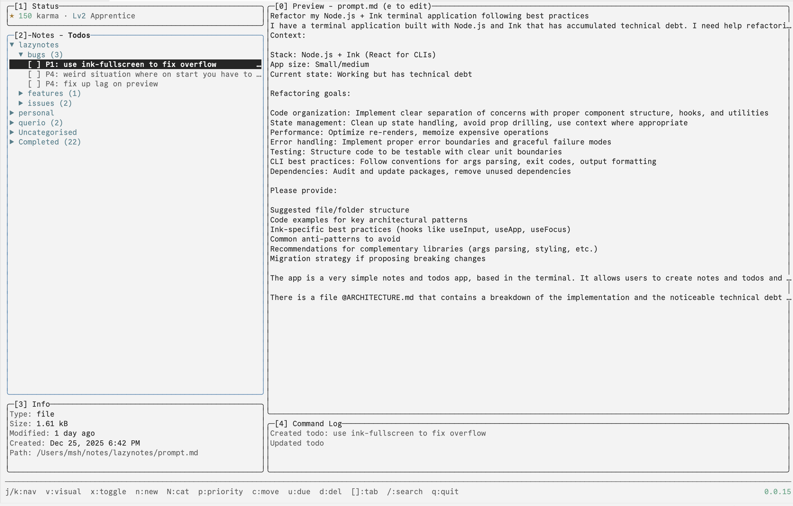

# lazynotes 
(new name pending)

## Overview
Lazynotes is a super simple notes and todos management terminal application, heavily inspired by [lazygit](https://github.com/jesseduffield/lazygit).



It's still in it's infancy so relax about features.

## Installation

### Prerequisites
- Node.js (v18 or higher)
- npm

### From Source
```bash
# Clone the repository
git clone https://github.com/MSH-01/lazynotes.git
cd lazynotes

# Install dependencies
npm install

# Run the application
npm start
```

### Global Install (Development)
```bash
# From the project directory
npm link

# Now you can run from anywhere
lazynotes
```

### Notes
Currently allows you to create new notes and directories, stored in your root /notes. The notes is pretty basic, you can edit with vim (default behaviour)

### Todos
You can create todo items, categories, subcategories, due dates, priorities and earn some karma by ticking them off (todoist inspired).

## Key Features

### Visual Mode (Batch Operations)
- Press `v` to enter visual selection mode
- `j/k` extends selection range (highlighted in blue)
- Operations apply to all selected items:
  - Files: `d` batch delete
  - Todos: `x` toggle, `d` delete, `p` priority, `c` category, `u` due date
- Auto-exits when switching tabs or panels
- Escape cancels selection

### Hierarchical Categories
- Slash notation: `Work/Projects/Q1`
- Creating sub-category auto-creates parents
- Collapsing parent hides all children
- Deleting parent cascades to children (todos → Uncategorised)
- Helper functions in `todos.ts`:
  - `parseCategoryPath()`, `getParentPath()`, `getCategoryDepth()`
  - `isDescendantOf()`, `isCategoryVisible()`, `sortCategoriesHierarchically()`

### Search/Filter System
- Press `/` to start search (fuzzy matching via fuzzysort)
- Type query, Enter confirms filter
- Escape clears filter
- Files: searches file names
- Todos: searches todo text only (not categories)
- Implemented via `useFilteredList` hook

### Karma System (Gamification)
- Points awarded for todo actions, displayed in Status panel
- Stored in `~/.config/lazynotes/karma.json`

| Action | Points |
|--------|--------|
| Complete P1 todo | +40 |
| Complete P2 todo | +30 |
| Complete P3 todo | +20 |
| Complete P4 todo | +10 |
| Create todo | +5 |
| Uncomplete todo | -points |
| Delete incomplete | -5 |

| Karma | Level | Title |
|-------|-------|-------|
| 0-99 | 1 | Beginner |
| 100-499 | 2 | Apprentice |
| 500-999 | 3 | Achiever |
| 1000-2499 | 4 | Pro |
| 2500-4999 | 5 | Expert |
| 5000-9999 | 6 | Master |
| 10000+ | 7 | Enlightened |

## Known Issues
- [ ] Jarring overflow when you first load into the app - focus on a panel using `0`, `1`, `2` to fix

## Roadmap
**Notes**
- [ ] File search
- [ ] Backlinks
- [ ] Tags
- [ ] Custom frontmatter
- [ ] Categories / Subcategories

**Todos**
- [ ] Edit existing todos
- [ ] Filtering
- [ ] Auto-archive for completed todos
